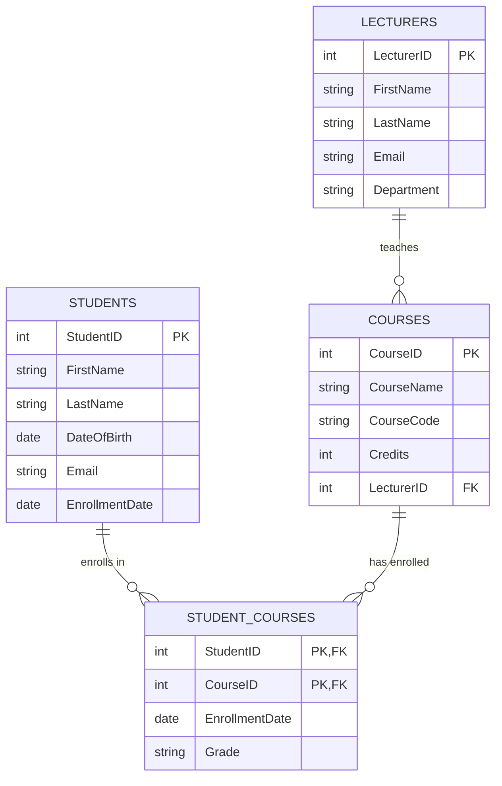
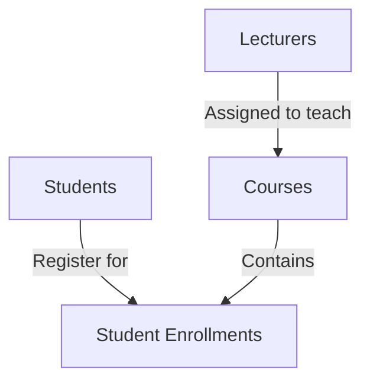

# CTU Student Management System Database Schema

Below is the Entity-Relationship (ER) diagram representing the structure of our database:

```mermaid
erDiagram
    LECTURERS {
        int LecturerID PK
        string FirstName
        string LastName
        string Email
        string Department
    }
    
    COURSES {
        int CourseID PK
        string CourseName
        string CourseCode
        int Credits
        int LecturerID FK
    }
    
    STUDENTS {
        int StudentID PK
        string FirstName
        string LastName
        date DateOfBirth
        string Email
        date EnrollmentDate
    }
    
    STUDENT_COURSES {
        int StudentID PK, FK
        int CourseID PK, FK
        date EnrollmentDate
        string Grade
    }

    LECTURERS ||--o{ COURSES : "teaches"
    STUDENTS ||--o{ STUDENT_COURSES : "enrolls in"
    COURSES ||--o{ STUDENT_COURSES : "has enrolled"
```

## High-Level Flow Chart

```mermaid
flowchart TD
    Lecturers[Lecturers] -->|Assigned to teach| Courses[Courses]
    Students[Students] -->|Register for| StudentCourses[Student Enrollments]
    Courses -->|Contains| StudentCourses
```
